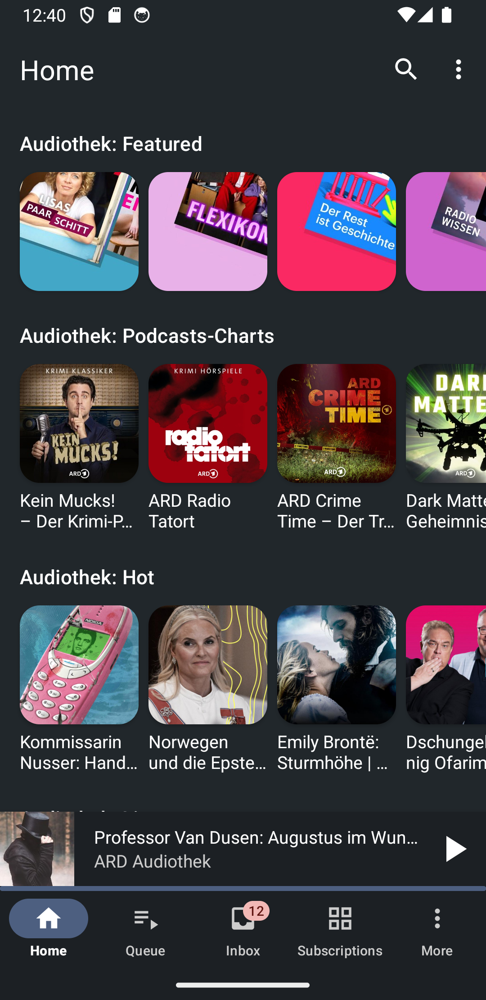

# Öffi Sounds

Öffi Sounds is a fork of [AntennaPod](https://github.com/AntennaPod/AntennaPod), the free and open-source podcast manager for Android.

It focuses on discovering and listening to content from German public radio via **ARD Sounds** (formerly **ARD Audiothek**), while keeping the core AntennaPod podcast management and playback experience.

## Differences vs AntennaPod

- **ARD Sounds / ARD Audiothek integration**: included as a search provider, plus special home screen modules focused on public radio content.
- **Nextcloud SSO**: Nextcloud sync login via the Nextcloud app account chooser (no manual username/password entry).

## Downloads

APK releases are published on GitHub:
https://github.com/thrillfall/OeffiSounds/releases

### Latest Release (1.2.0)

- Fetch all available ARD Sounds / Audiothek episodes by appending `?limit=100` when downloading feeds, while keeping stored subscription URLs clean without the query string.

## Support / Issues

Please report bugs and feature requests here:
https://github.com/thrillfall/OeffiSounds/issues

## License

Öffi Sounds (and upstream AntennaPod) is licensed under the GNU General Public License (GPL-3.0). You can find the license text in the `LICENSE` file.

## Translations

Translations are handled on Weblate:
https://hosted.weblate.org/projects/antennapod/

## Building

Build like a standard Android/Gradle project. The release artifact used for distribution is built via:

`./gradlew :app:assembleFreeRelease`

