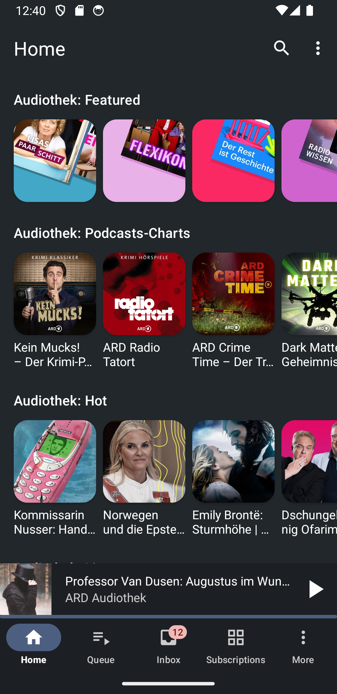

# Öffi Sounds

Öffi Sounds is a fork of [AntennaPod](https://github.com/AntennaPod/AntennaPod), the free and open-source podcast manager for Android.

It focuses on discovering and listening to content from German public radio via **ARD Sounds** (formerly **ARD Audiothek**), while keeping the core AntennaPod podcast management and playback experience.

## Differences vs AntennaPod

- **ARD Sounds / ARD Audiothek integration**: included as a search provider, plus special home screen modules focused on public radio content.
- **BBC Sounds integration**: search and subscribe to BBC podcasts (opt-in via Settings → Search).
- **SRF Play integration**: search and discover Swiss public radio podcasts (opt-in via Settings → Search).
- **ORF Sound integration**: search and discover Austrian public radio podcasts (opt-in via Settings → Search).
- **Deutschlandfunk integration**: search and discover podcasts from Deutschlandfunk and Deutschlandfunk Kultur (opt-in via Settings → Search).
- **RTVE integration**: search and discover podcasts from Spain's public broadcaster (opt-in via Settings → Search).
- **Nextcloud SSO**: Nextcloud sync login via the Nextcloud app account chooser (no manual username/password entry).
- **Provider Choice**: user can select whoch podcast services to query (and which not).

## Downloads

APK releases are published on GitHub:
https://github.com/thrillfall/OeffiSounds/releases

### Latest Release (2.7.5)

- Fix infinite sync loop: subscription sync no longer loops endlessly when non-subscribed feeds exist in the database

### Previous Releases

#### 2.7.1

- Fix Nextcloud sync: subscription upload no longer fails with "No value for update_urls" error (regression from SSO rewrite)

#### 2.7.0

- RTVE integration: search and discover podcasts from Spain's public broadcaster
- Home screen: new "RTVE: Podcasts" section

#### 2.6.0

- Deutschlandfunk integration: search and discover podcasts from Deutschlandfunk and Deutschlandfunk Kultur
- Home screen: new "Deutschlandfunk: Beliebte Podcasts" section

#### 2.5.0

- ORF Sound integration: search and discover Austrian public radio podcasts
- Home screen: new "ORF Sound: Podcasts" section
- Search provider settings: individual toggles instead of multi-select dialog
- Apple (iTunes) and Podcast Index disabled by default

#### 2.4.1

- "What's New" popup shown once after updating, highlighting new provider integrations

#### 2.4.0

- SRF Play integration: search and discover Swiss public radio podcasts (opt-in via Settings → Search)
- Home screen: new "SRF Play: Beliebte Podcasts" section showing popular SRF podcasts

#### 2.0.2

- BBC Sounds — filter out search results with no valid podcast RSS feed, reducing dead subscription links

#### 2.0.1

- ARD Sounds — renamed from ARD Audiothek

#### 2.0.0

- BBC Sounds — find and subscribe to BBC sounds podcasts (opt-in via Settings → Search)
- Search providers — user can now select which podcast services to query in settings
- ARD Audiothek — updated to new playout API for the "Was ist heute wichtig" section

## Support / Issues

Please report bugs and feature requests here:
https://github.com/thrillfall/OeffiSounds/issues

## License

Öffi Sounds (and upstream AntennaPod) is licensed under the GNU General Public License (GPL-3.0). You can find the license text in the `LICENSE` file.

## Translations

Translations are handled on Weblate:
https://hosted.weblate.org/projects/antennapod/

## Building

Build like a standard Android/Gradle project. The release artifact used for distribution is built via:

`./gradlew :app:assembleFreeRelease`

